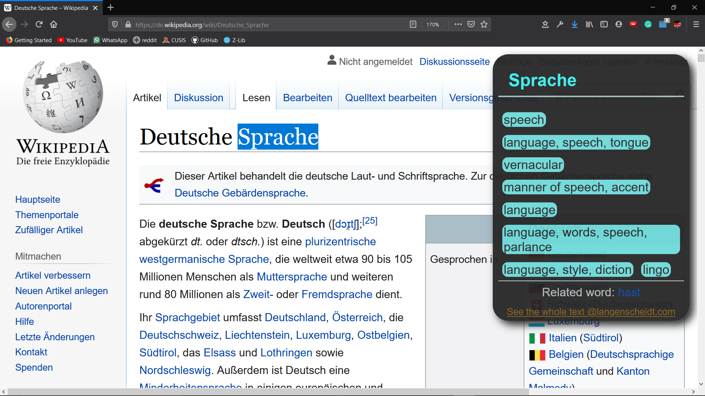
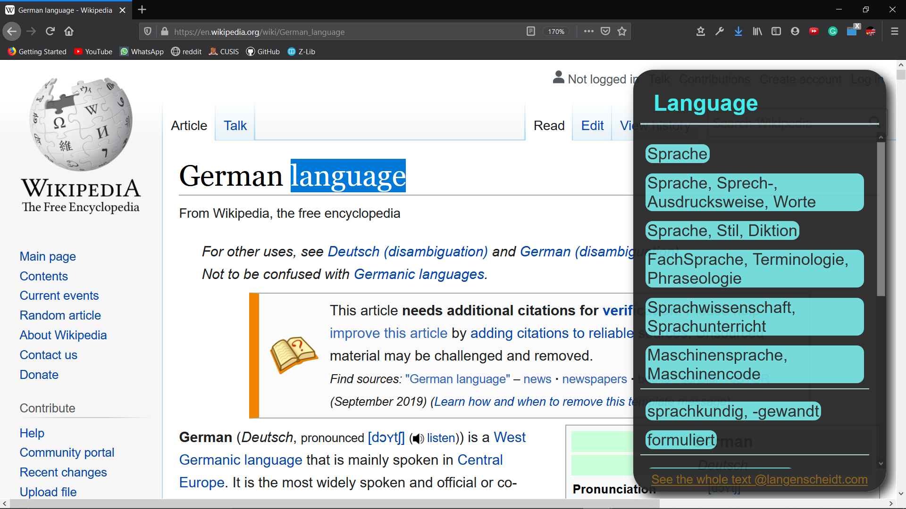

# firefox-browser-extension-German2English
A firefox browser extension translate between german and english for you whenever you selecte a word in the browser

[Link to firefox addons](https://addons.mozilla.org/en-US/firefox/addon/german-2-english/)

## Example

